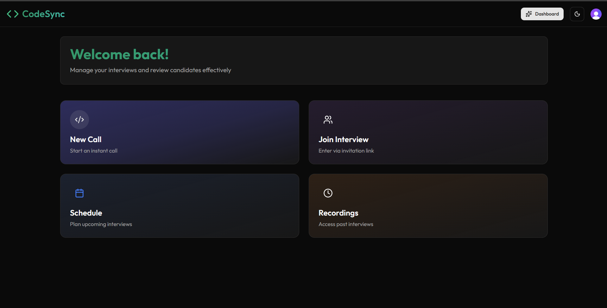
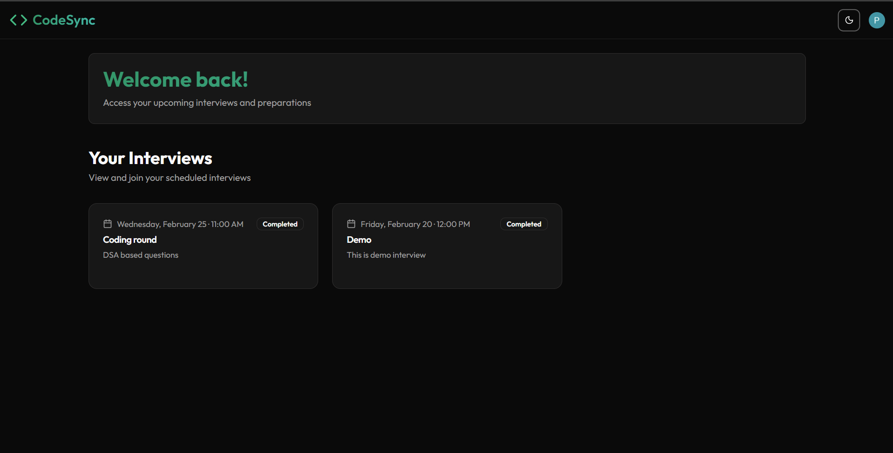
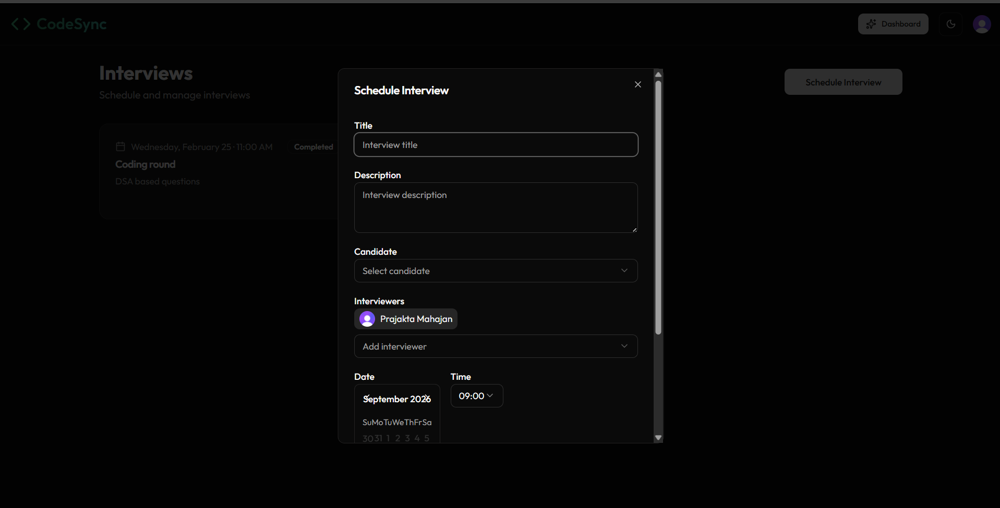
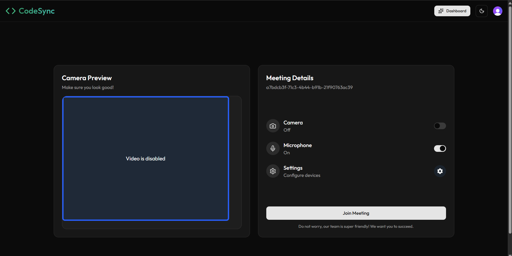

# 💻 SkillSync – Remote Coding Interview Platform

SkillSync is a **real-time remote coding interview platform** designed to simplify technical interviews by bringing authentication, interview management, video communication, and collaborative coding into one platform.

## ✨ Features

- 🔐 Secure authentication with **Clerk**
- 📅 Interview scheduling and management
- 🎥 Real-time video/audio calls using **Stream Video SDK**
- 🖥️ Screen sharing, recording, and reactions
- 💻 Coding environment with **Monaco Editor**
- 🌐 Multi-language coding support
- 📝 Candidate comments and evaluations
- ⚡ Real-time data and interview operations using **Convex**
- 👥 Role-based workflows for candidates and interviewers

## 🛠️ Tech Stack

**Frontend:** Next.js, React, TypeScript, Tailwind CSS  
**Authentication:** Clerk  
**Database & Backend:** Convex  
**Video Communication:** Stream Video SDK  
**Code Editor:** Monaco Editor

## 📸 Screenshots

### 🏠 Dashboard



### 📅 Interview Scheduling


### 🎥 Live Interview



## ⚙️ Run Locally

```bash
git clone https://github.com/your-username/SkillSync.git
cd SkillSync
npm install
npm run dev
